This Repository is shown the outputs of the following code:

Question1:Outputs

a. Print Odd Numbers in an array

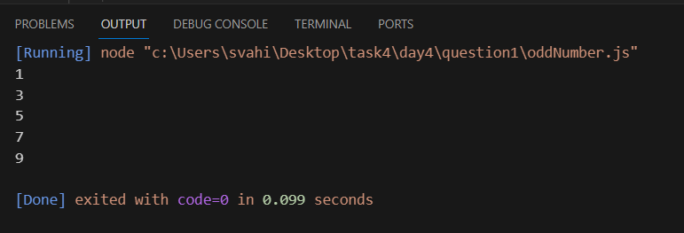

b. Convert all the strings to title caps in a string array

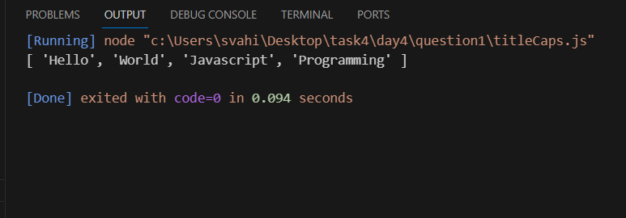

c. Sum of all numbers in an array

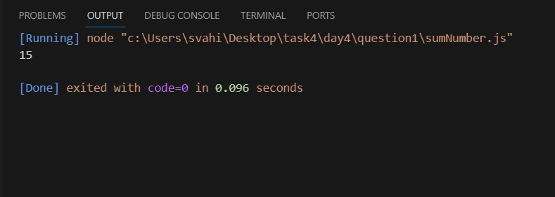

d. Return all the prime numbers in an array

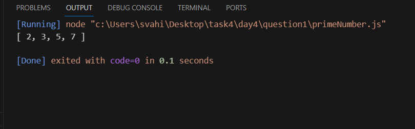

e. Return all the palindromes in an array

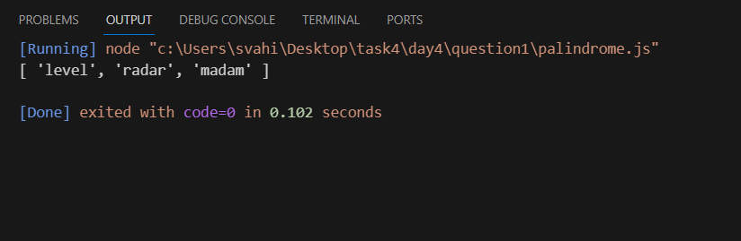

f. Return median of two sorted array of the same size

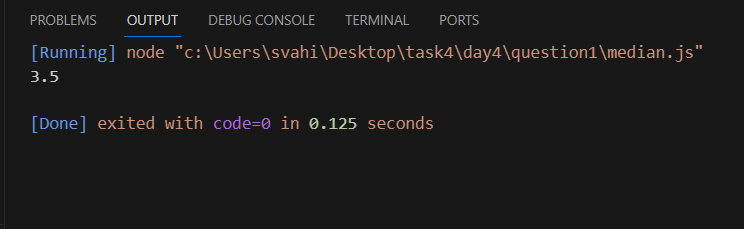

g. Remove duplicates from an array

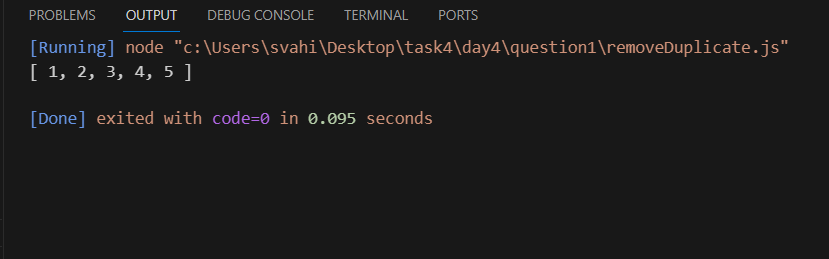

h. Rotate an array by k times

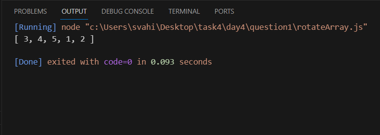

Question2:Outputs

a. Print odd numbers in an array

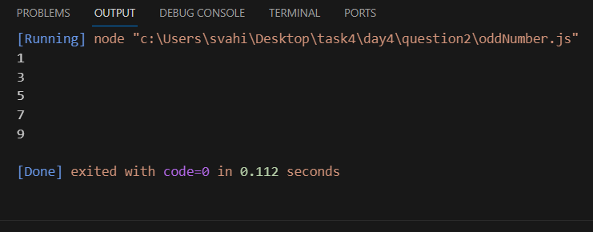

b. Convert all the strings to title caps in a string array

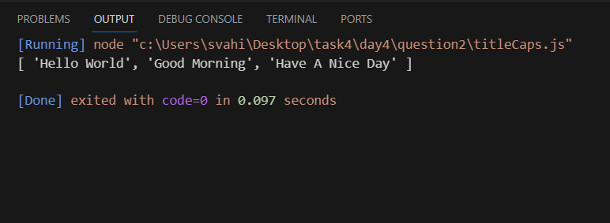

c. Sum of all numbers in an array

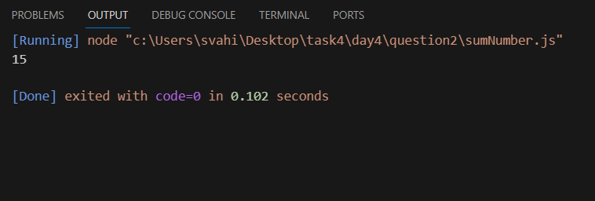

d. Return all the prime numbers in an array

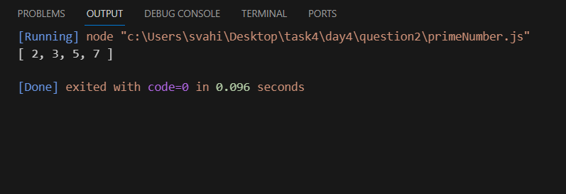

e. Return all the palindromes in an array

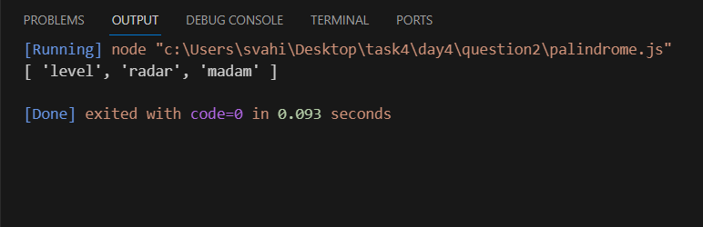